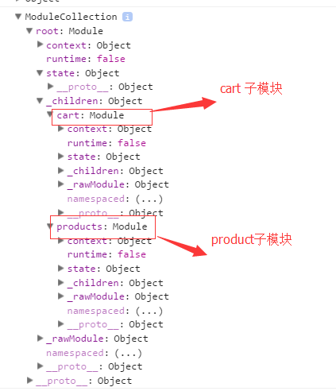

```javascript
// new Vuex.Store(options)
const userStore = new Vuex.Store({
  state: {
    userInfo: {}
  },
  getters: {
    getUserInfo(state) {
      return state.userInfo;
    }
  },
  mutations: {
    setUserInfo(state, userInfo) {
      state.userInfo = userInfo;
    }
  },
  actions: {
    setUserInfo({ commit }, user) {
      commit('setUserInfo', user);
    }
  }
});
console.log(userStore);//可以输出看下结果
```

###  this._modules = new ModuleCollection(options)

module-collection.js

```javascript
export default class ModuleCollection {

  constructor (rawRootModule) {
    //new Vuex.Store(options)中的options就是这个rawRootModule
    // register root module (Vuex.Store options)
    this.register([], rawRootModule, false)
  }
  //path:[]  rawModule:options  runtime:false
  register (path, rawModule, runtime = true) {
    if (process.env.NODE_ENV !== 'production') {
      //主要对传入的options对象中的 getters actions  mutations进行断言，判断传入的值是否符合要求
      assertRawModule(path, rawModule)
    }
	//rawModule :options  runtime :false
    const newModule = new Module(rawModule, runtime)
    if (path.length === 0) {
      //给store对象注册主模块
      this.root = newModule
    } else {
      //如果options存在modules属性，在递归注册子模块的时候，会走这里
      //这里也是通过reduce实现的查找，过程真的太优雅，reduce函数的强大之处
      const parent = this.get(path.slice(0, -1))
      parent.addChild(path[path.length - 1], newModule)
    }
	//给store对象递归注册子模块
    // register nested modules
    if (rawModule.modules) {
      forEachValue(rawModule.modules, (rawChildModule, key) => {
        //这里一点儿小的细节，对于path:[]，数组的concat方法不会改变原来的数组，会返回一个拼接后的新的数组
        //这里每次循环的时候，path就是[]或者上次的拼接后的数组，也就是register函数中传进来的path值
        this.register(path.concat(key), rawChildModule, runtime)
      })
    }
  }


}

//
const assertTypes = {
  getters: functionAssert,
  mutations: functionAssert,
  actions: objectAssert
}
function assertRawModule (path, rawModule) {
  Object.keys(assertTypes).forEach(key => {
    //这里对getters. mutations. actions 进行处理，如果没有传对应的属性值，则不进行处理
    if (!rawModule[key]) return

    const assertOptions = assertTypes[key]
//value:options.getters.getUserInfo   type:getUserInfo
    forEachValue(rawModule[key], (value, type) => {
      assert(
        assertOptions.assert(value),
        makeAssertionMessage(path, key, type, value, assertOptions.expected)
      )
    })
  })
}
```

util.js

```javascript
export function forEachValue (obj, fn) {
  Object.keys(obj).forEach(key => fn(obj[key], key))
}
```

下图展示 ： `store._modules`



module.js

返回值就是给到了 `store._modules.root`

```javascript
export default class Module {
  //rawModule:options ; runtime:false
  constructor (rawModule, runtime) {
    this.runtime = runtime  //false
    this._children = Object.create(null)
    this._rawModule = rawModule //传入的new Vuex.Store(options)中的options
    const rawState = rawModule.state
    this.state = (typeof rawState === 'function' ? rawState() : rawState) || {}
  }
  forEachChild (fn) {
    forEachValue(this._children, fn)
  }

  forEachGetter (fn) {
    if (this._rawModule.getters) {
      forEachValue(this._rawModule.getters, fn)
    }
  }

  forEachAction (fn) {
    if (this._rawModule.actions) {
      forEachValue(this._rawModule.actions, fn)
    }
  }

  forEachMutation (fn) {
    if (this._rawModule.mutations) {
      forEachValue(this._rawModule.mutations, fn)
    }
  }
}
```


