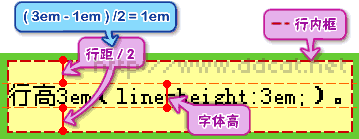

### 1 line-height取值问题

**line-height**：normal | <length> | <percentage> | <number>

normal：允许内容顶开或溢出指定的容器边界。**该属性在浏览器中默认是1-1.2**

length：用长度值指定行高。不允许负值。

percentage:用百分比指定行高，其百分比取值是基于字体的高度尺寸。不允许负值。

number:用乘积因子指定行高,其基准也是基于字体的高度尺寸。不允许负值。

### 2 line-height的继承问题

**line-height属性的值是可以被子元素继承的，也就是说，父元素的line-height属性的值会被子元素继承到**

* 对于父元素设置line-height属性为百分比，子元素继承父元素计算出来的结果；

```javascript
body{font-size:14px;line-height:150%;}
p{font-size:26px;}
//结果就是：
body{line-height:21px;}//14*150%=21
p{line-heigt:21px;}//继承父元素 
```

* 对于父元素设置line-height属性为数字，子元素继承该数字，根据自身文字高度计算本身的line-height

```javascript
body{font-size:14px;line-height:1.5;}
p{font-size:26px;}
//结果就是：
body{line-height:21px;} //14*1.5=21 
p{line-height:39px;} //26*1.5=39

```

* 对于父元素设置line-height属性为length ,子元素继承该length值

```javascript
body{font-size:14px;line-height:150px;}
p{font-size:26px;}
//结果就是：
body{line-height:150px;} //14*1.5=21 
p{line-height:150px;} //26*1.5=39
```

### 3 line-height如何影响一个元素的高度

[单行和多行的区别](http://www.zhangxinxu.com/study/200911/line-height-text-v-center.html)

- line-height只影响行内元素，并不能直接作用于块级元素。
- line-height 具有可继承性，块级元素的子元素会继承该特性，并且在行内元素上生效。
- 一定要注意line-height属性作用的对象是行内元素，行内元素，

该属性会影响行框的布局。在应用到一个块级元素时，它定义了该元素中 (该元素中可能有多行文本) 基线之间的最小距离而不是最大距离。

从上面的链接案例可以看出来，给一个元素设置line-height属性之后，其内可以有单行，也可以有多行（br换行）其中每一行都会受到line-height属性的布局影响；

看下基本定义：“行高”顾名思意指一行文字的高度。具体来说是指两行文字间基线之间的距离。基线实在英文字母中用到的一个概念，我们刚学英语的时使用的那个英语本子每行有四条线，其中底部第二条线就是基线，是a,c,z,x等字母的底边线。

####3.1 基本概念：


#### 3.2 内容区（content area）

内容区是指底线和顶线包裹的区域（行内元素display：inline可以通过background-color属性显示出来），实际中不一定看得到，但确实存在。**内容区的大小依据font-size的值和字数进行变化。**

#### 3.3 行高

行高（line-height）：包括内容区与以内容区为基础对称拓展的空白区域，我们称之为行高。一般情况下，也可以认为是相邻文本行基线间的距离。

#### 3.4 行内框（inline boxes）

行内框是一个浏览器渲染模型中的一个概念，无法显示出来，但是它又确实存在，它的高度就是行高指定的高度。

​	

#### 3.5 行框 （line boxes)

每一行就是一个行框盒子，由一个个内联盒子组成；


#### 3.6 “包含盒子”（containing box）

由一行一行的行框盒子组成，比如一个p元素内可能有多行（br换行),每一行都有一个line-height；

**每一行的基线，底线，顶线，中线唯一，一个块级元素可以有多行，line-height会作用于多行**

对于块级元素其高度到底是如何撑开的呢？

css代码：

```css	
.test1{font-size:20px; line-height:0; border:1px solid #cccccc; background:#eeeeee;}
.test2{font-size:0; line-height:20px; border:1px solid #cccccc; background:#eeeeee;}
```

html代码：

```html
<div class="test1">测试</div>
<div class="test2">测试</div>
```

可以发现一个块级元素的行高其实是由内容区撑开的，也就是字体的font-size撑开的，如果有line-height则就是由line-height撑开，当然了，如果有固定的高度，那么其高度就是height;